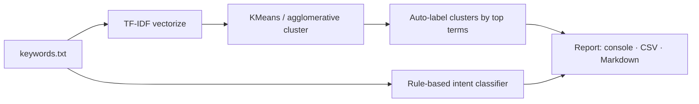

# seo-keyword-clusters

> Group a seed keyword list into topic clusters and classify each keyword's search intent — the groundwork for content planning.


## Overview

`seo-keyword-clusters` takes a flat list of keywords and does two things content teams need before they write anything: it **clusters** the keywords into topic groups (TF-IDF + KMeans / agglomerative) and **classifies the search intent** of each keyword (informational / navigational / commercial / transactional) with a transparent rule-based classifier. Output is a readable console view plus CSV/Markdown export.

Topic clustering and intent are kept deliberately separate: generic commercial modifiers ("best", "buy", "cheap") signal *intent*, not *subject*, so they're excluded from the clustering vectors and handled by the intent classifier instead.

## Architecture



## Features

- Topic clustering with **KMeans** (default) or **agglomerative**, fully reproducible via a fixed `random_state`
- Automatic cluster labels from each group's most distinctive TF-IDF terms
- Transparent, lexicon-based **intent classification** (informational / navigational / commercial / transactional)
- Heuristic default cluster count (≈ √N, bounded) when you don't specify one
- Console, CSV, and Markdown output
- Fully offline — bundled sample keyword list, no external services

## Tech stack

Python 3.11 · scikit-learn · pandas · Click · Rich

## Getting started

```bash
pip install -e .
# cluster + classify the bundled sample list
seo-keyword-clusters run
# point at your own file, choose the number of clusters, export Markdown
seo-keyword-clusters run -k data/keywords_sample.txt -n 6 --markdown clusters.md
```

## Usage

All work happens under the `run` subcommand. Point `-k`/`--keywords` at any newline-delimited keyword file (or omit it to use the bundled sample). The tool prints each topic cluster with its auto-derived label and members, and an intent column per keyword. Use `-n`/`--num-clusters` to set the cluster count and `--csv` / `--markdown` to export. With two clearly separable themes and `-n 2`, each theme collapses into its own cluster — the behavior the test suite pins down.

## Project structure

```
keywordclusters/
  cluster.py    # TF-IDF vectorize + cluster + auto-label
  intent.py     # rule-based intent classifier + lexicons
  io_utils.py   # load keywords, export CSV / Markdown
  cli.py        # Click entrypoint
data/           # sample keyword list
tests/          # pytest: clustering separation, determinism, intent rules
```

## Testing

```bash
pip install -e ".[dev]"
pytest
```

## Roadmap

- Embedding-based clustering (swap TF-IDF for sentence embeddings)
- Optional search-volume / difficulty input to prioritize clusters
- Suggested pillar-page + supporting-article structure per cluster

## License

MIT © 2026 Matthews Wong

---

_Part of my cloud & AI portfolio — see [github.com/matthews-wong](https://github.com/matthews-wong)._
